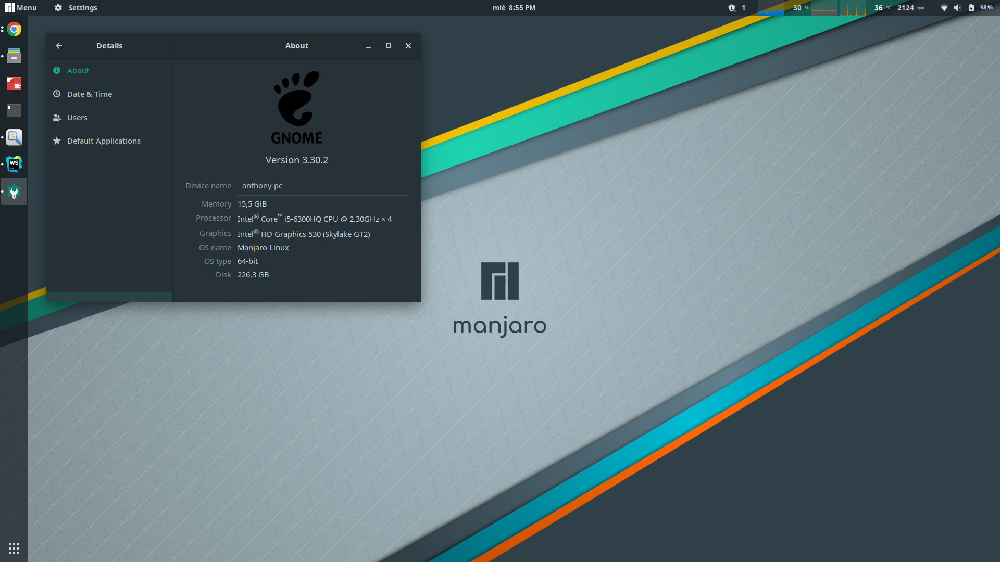
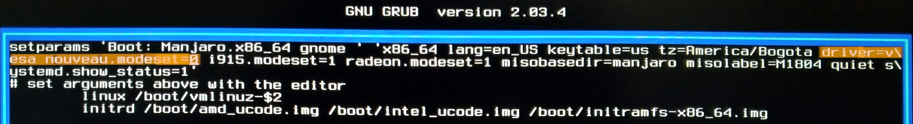
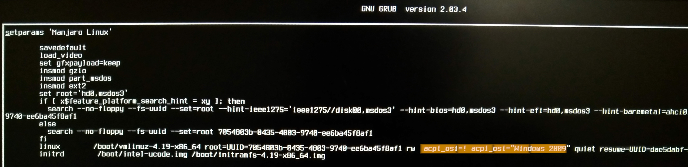

# Manjaro Gnome on Dell i7559



This repo contains useful information to install and configure Manjaro Gnome on dell Inspiron 7559

## Configuration to install manjaro

### 1. LiveCD Grub

When LiveCD grub loaded, press `e` key to edit the parameters that allow manjaro to start
```text
driver=vesa mouveau.modeset=0
```
Like this:


Press `F10` key to save and boot, then install manjaro as usual.

### 2. Configure grub

The first time you boot manjaro won't start, we need to add new parameters to allow the system start

In the grub screen, press `e` key to edit the manjaro option and add the next parameters:
```text
acpi_osi=! acpi_osi="Windows 2009"
```
Like this:


Press `F10` key to save and boot.

Add `acpi_osi=! acpi_osi=\"Windows 2009\"` to your GRUB_CMDLINE_LINUX_DEFAULT on `/etc/default/grub` 
```bash
$ sudo gedit /etc/default/grub
```
It should looks like this:
```text
GRUB_DEFAULT=saved
GRUB_TIMEOUT=5
GRUB_TIMEOUT_STYLE=menu
GRUB_DISTRIBUTOR='Manjaro'
GRUB_CMDLINE_LINUX_DEFAULT="acpi_osi=! acpi_osi=\"Windows 2009\" quiet
```
Finally run `$ sudo update-grub`.

## Things to do after install Manjaro Gnome

#### Update the mirrors and the system, run:
```bash	
$ sudo pacman-mirrors --fasttrack && sudo pacman -Syyu
```
This will take several minutes, so grab a cup of coffee

#### Install Nvidia drivers
```bash
$ sudo pacman -S virtualgl lib32-virtualgl lib32-primus primus
$ sudo mhwd -f -i pci video-hybrid-intel-nvidia-bumblebee
$ sudo systemctl enable bumblebeed
```
Reboot the system and try if the installation was ok:
```bash
$ primusrun glxspheres64
$ optirun -b none nvidia-settings -c :8
```
Wiki info: [link](https://wiki.manjaro.org/index.php?title=Configure_NVIDIA_(non-free)_settings_and_load_them_on_Startup#Bumblebee_and_Steam)


#### Activate the AUR repository in the package manager 
- Open add/remove software
- click menu option
- Preferences
- go to the AUR tap
- Check: Enable AUR support
- Check: Updates from AUR

#### Install Oracle JDK 8
```bash
$ pamac build jdk8
```

Select oracle jdk 8 as default
```bash
$ sudo archlinux-java set java-8-jdk
```
Add the env variable to ./bashrc
```bash
$ echo 'export JAVA_HOME=/usr/lib/jvm/default' >> ~/.bashrc
$ exec $SHELL
```

### Install nvm for node
```bash
$ pamac build nvm
$ echo 'source /usr/share/nvm/init-nvm.sh' >> ~/.bashrc
$ exec $SHELL
$ nvm install 10.5.3
```

### Install System apps
```bash
$ sudo pacman -S maven
$ sudo pacman -S gradle
$ sudo pacman -S terminator
$ sudo pacman -S vlc
$ sudo pacman -S gimp
```

### Remove not necessary packages
```bash
$ sudo pacman -Rs ms-office-online
```

### Install AUR apps
```bash
$ pamac build google-chrome
$ pamac build postman-bin
$ pamac build android-studio
$ pamac build giteye
$ pamac build webstorm
$ pamac build datagrip
$ pamac build pycharm
$ pamac build intellij-idea-ultimate-edition
$ pamac build spotify
$ pamac build skypeforlinux-stable-bin
$ pamac build popcorntime-bin

$ pamac build copyq
$ pamac build openfortivpn
$ pamac build wps-office
```

### Install gnome shell plugins
- system-monitor: https://extensions.gnome.org/extension/120/system-monitor/
- no-topleft-hot-corner: https://extensions.gnome.org/extension/118/no-topleft-hot-corner/

### Install and configure docker 

install docker and docker compose
```bash
$ sudo pacman -S docker docker-compose
$ sudo systemctl start docker
$ sudo systemctl enable docker
$ sudo usermod -aG docker $USER
```

### Solve the Issue with the bluetooth audio

LDAC/aptX codec support can be enabled by installing pulseaudio-modules-bt-git
```bash
$ pamac build pulseaudio-modules-bt-git
```

If PulseAudio fails when changing the profile to A2DP while using GNOME with GDM, you need to prevent GDM from starting its own instance of PulseAudio

- Prevent Pulseaudio clients from automatically starting a server if one is not running by adding the following:
```bash
$ sudo gedit /var/lib/gdm/.config/pulse/client.conf
```
and add:
```text
autospawn = no
daemon-binary = /bin/true
```

- Prevent systemd from starting Pulseaudio anyway with socket activation:
```bash
$ sudo -ugdm mkdir -p /var/lib/gdm/.config/systemd/user
$ sudo -ugdm ln -s /dev/null /var/lib/gdm/.config/systemd/user/pulseaudio.socket
```
- Restart, and enjoy. 

## References
[Inspiration](https://github.com/oguzkaganeren/manjaroGnomeDell7559.github.io/blob/master/index.md)